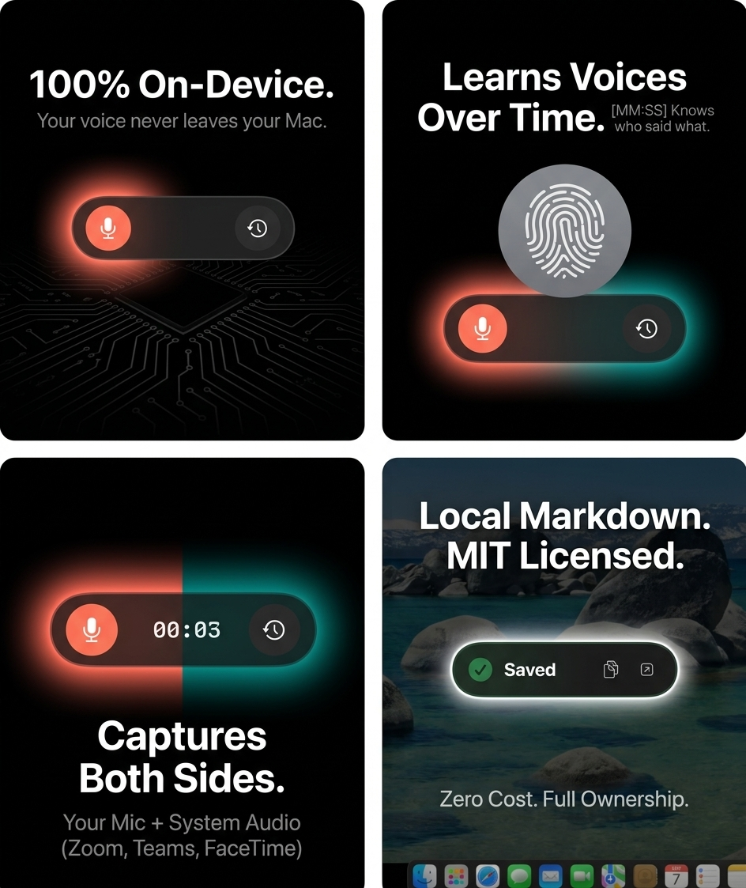
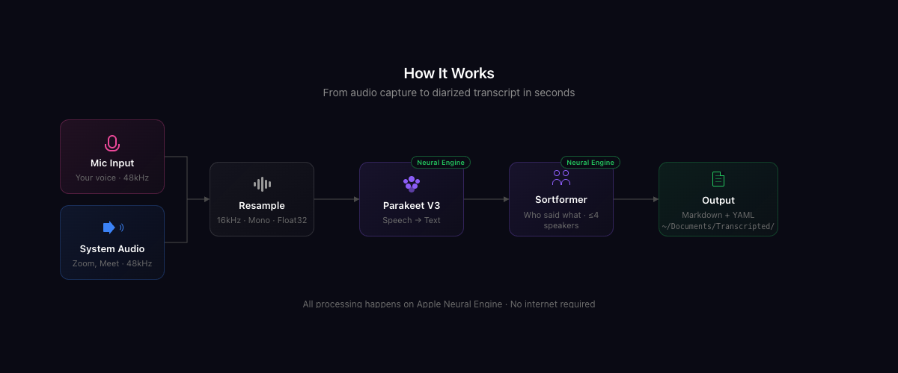
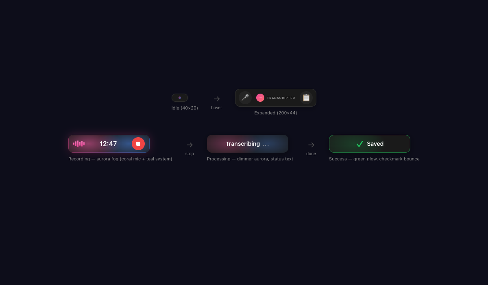
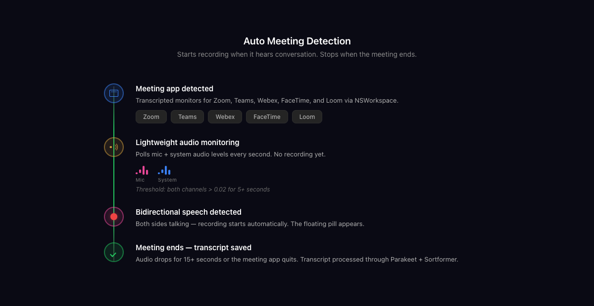
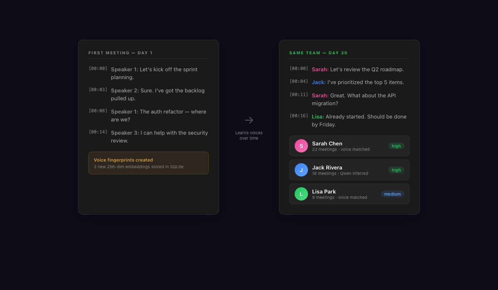
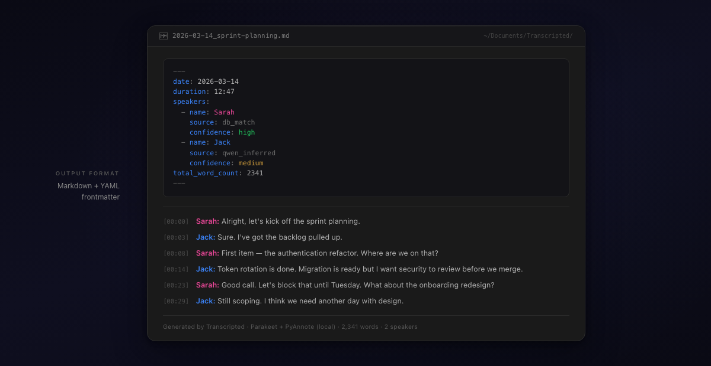

<p align="center">
  
</p>

<h1 align="center">Transcripted</h1>

<p align="center">
  <strong>Record, transcribe, and identify speakers — entirely on your Mac.</strong>
</p>

<p align="center">
  <em>Every conversation stays on your device. No cloud. No subscription. No compromise.</em>
</p>

<p align="center">
  <a href="https://github.com/r3dbars/transcripted/releases/latest"></a>
  <a href="https://github.com/r3dbars/transcripted/releases"></a>
  
  
  <a href="https://github.com/r3dbars/transcripted/blob/main/LICENSE"></a>
  <a href="https://github.com/r3dbars/transcripted/commits/main"></a>
  <a href="https://github.com/r3dbars/transcripted/stargazers"></a>
</p>

<!-- TODO: Replace with actual app GIF showing pill recording → transcript appearing -->
<p align="center">
  
</p>

## Contents

- [Why Transcripted](#why-transcripted)
- [Install](#install)
- [How It Works](#how-it-works)
- [Features](#features)
- [Sample Output](#sample-output)
- [Comparison](#comparison)
- [Privacy & Security](#privacy--security)
- [Configuration](#configuration)
- [Troubleshooting](#troubleshooting)
- [Architecture](#architecture)
- [Roadmap](#roadmap)
- [Contributing](#contributing)
- [Acknowledgements](#acknowledgements)
- [License](#license)

## Why Transcripted

- **100% Private** — Audio never leaves your Mac. All models run locally on the Neural Engine. No network requests, no telemetry, no analytics.
- **Speaker Identification** — Learns voices over time with persistent fingerprints. Knows who said what across meetings, even weeks apart.
- **Zero Cost** — Free forever. No subscriptions, no usage limits, no "free tier" with asterisks. MIT licensed.
- **Works With Everything** — Captures audio from Zoom, Google Meet, Teams, Webex, FaceTime, Loom — anything that plays through your speakers.
- **Set It and Forget It** — Lives in your menu bar. Press `⌘⇧R` or let auto-detection start recording when a meeting begins. Transcripts land in `~/Documents/Transcripted/` as clean Markdown.

## Install

### Download

<p align="center">
  <a href="https://github.com/r3dbars/transcripted/releases/latest">
    
  </a>
</p>

1. Download the `.dmg` from the [latest release](https://github.com/r3dbars/transcripted/releases/latest)
2. Drag **Transcripted** to Applications
3. Launch and grant permissions when prompted (Microphone required, Screen Recording for system audio)
4. Models download automatically on first launch (~600 MB for Parakeet, ~2.5 GB if Qwen is enabled)

### Build from Source

```bash
git clone https://github.com/r3dbars/transcripted.git
cd transcripted
open Transcripted.xcodeproj
```

1. Select your **Development Team** under Signing & Capabilities
2. Press **⌘R** to build and run
3. Models download automatically from HuggingFace on first launch

**Requirements:** macOS 14.2+, Xcode 15+, Swift 5.9+

### Permissions

| Permission | Purpose | Required |
|---|---|---|
| Microphone | Capture your voice | Yes |
| Screen Recording | Capture system audio from Zoom, Meet, Teams, etc. | For system audio |
| Accessibility | Global hotkey from other apps | For ⌘⇧R |
| Notifications | Transcript saved alerts | Optional |

## How It Works

Transcripted captures audio from your microphone and system output, runs speech-to-text locally on the Neural Engine, identifies who is speaking, and saves structured Markdown transcripts to your filesystem. Speaker fingerprints persist across sessions — the app learns voices over time.

<p align="center">
  
</p>

| Model | Role | Size |
|---|---|---|
| **Parakeet TDT V3** | Speech-to-text | ~600 MB |
| **PyAnnote** | Speaker diarization (unlimited speakers) | Bundled |
| **WeSpeaker** | Voice embeddings (256-dim fingerprints) | Bundled |
| **Qwen 3.5-4B** | Speaker name inference from context | ~2.5 GB (optional) |

All models run locally via [FluidAudio](https://github.com/FluidAudio) — no internet connection required after first download.

## Features

### Recording

<p align="center">
  
</p>

- **Floating pill UI** — A Dynamic Island-style pill floats above all windows with aurora animations color-coded by audio source (coral for mic, teal for system audio). Minimal, beautiful, out of the way.
- **Dual audio capture** — Records both your microphone and system audio simultaneously. Hears both sides of every call.

<p align="center">
  
</p>

- **Auto meeting detection** — Monitors for meeting apps and automatically starts recording when it detects sustained bidirectional speech. Stops when audio drops or the meeting app quits.
- **Global hotkey** — `⌘⇧R` toggles recording from any app. No window switching needed.
- **Recording health monitoring** — Real-time quality tracking with capture quality grades, audio gap detection, and device switch monitoring.

### Transcription

<p align="center">
  
</p>

- **Persistent voice fingerprints** — Voice embeddings stored in a local SQLite database. Returning speakers are recognized across sessions, even weeks apart.
- **Speaker name inference** — On-device Qwen 3.5-4B LLM analyzes conversation context ("Hey Sarah, can you pull up the report?") to infer and assign speaker names automatically.
- **Unlimited speakers** — PyAnnote offline diarization handles multi-speaker conversations with no speaker limit. Sortformer streaming available for future real-time preview.
- **Smart post-processing** — Automatic speaker merging, database-informed splitting, and name variant handling (Mike↔Michael, Nate↔Nathan, etc.).

### Output

- **Markdown transcripts** — Clean `.md` files with YAML frontmatter (date, duration, word count, speaker metadata, capture quality metrics).
- **`[MM:SS]` timestamps** — Every utterance is timestamped for easy reference.
- **Obsidian-ready** — Optional Obsidian-compatible frontmatter with tags, aliases, and CSS classes.
- **Auto-save** — Transcripts saved to `~/Documents/Transcripted/` (customizable).
- **Agent-ready** — JSON sidecar files and index for automation workflows.

### Stats

- Total hours transcribed, recording count, and active days
- Current and longest recording streaks
- Monthly activity heatmap
- Recent transcript quick-access

## Sample Output

<p align="center">
  
</p>

```yaml
---
title: Weekly Standup
date: 2025-06-12T09:00:00
duration: 23m 47s
speakers: [Sarah Chen, Marcus Johnson, You]
words: 3842
capture_quality: excellent
audio_sources: [microphone, system_audio]
---
```
```
Sarah Chen [0:00]
Good morning everyone. Let's start with updates from the backend team.

Marcus Johnson [0:12]
Sure. We shipped the new caching layer yesterday. Response times dropped about 40%.

You [0:28]
Nice. I saw the metrics this morning — the P99 latency improvement is significant.
```

## Comparison

### vs. Cloud Transcription Services

| | Transcripted | Otter.ai | Fireflies.ai | Fathom | tl;dv |
|---|:---:|:---:|:---:|:---:|:---:|
| **Processing** | 100% local | Cloud | Cloud | Cloud | Cloud |
| **Meeting bot joins call** | No | Yes | Yes | Yes | Yes |
| **Speaker diarization** | ✅ | ✅ | ✅ | ✅ | ✅ |
| **Learns voices over time** | ✅ | ❌ | ❌ | ❌ | ❌ |
| **Speaker name inference** | ✅ (on-device) | ❌ | ❌ | ❌ | ❌ |
| **Works offline** | ✅ | ❌ | ❌ | ❌ | ❌ |
| **Open source** | ✅ MIT | ❌ | ❌ | ❌ | ❌ |
| **Price** | **Free forever** | $8–$30/mo | $10–$39/mo | $15–$39/mo | $18–$59/mo |
| **Data location** | Your Mac | US cloud | US cloud | US cloud | EU cloud |
| **Audio retained** | Deleted after transcription | Stored on servers | Stored on servers | Stored on servers | Stored on servers |

<details>
<summary><strong>vs. Privacy-Focused & Local Tools</strong></summary>

| | Transcripted | Granola | Krisp | MacWhisper | Meetily |
|---|:---:|:---:|:---:|:---:|:---:|
| **Processing** | 100% local | Hybrid (cloud AI) | On-device | 100% local | 100% local |
| **Speaker diarization** | ✅ PyAnnote | ❌ desktop | ✅ | ⚠️ Beta | ⚠️ PoC |
| **Learns voices** | ✅ | ❌ | ❌ | ❌ | ❌ |
| **Name inference** | ✅ Qwen | ❌ | ❌ | ❌ | ❌ |
| **Auto meeting detection** | ✅ | ❌ | ❌ | ❌ | ❌ |
| **Works fully offline** | ✅ | ❌ | ✅ (English) | ✅ | ✅ |
| **Open source** | ✅ MIT | ❌ | ❌ | ❌ | ✅ MIT |
| **Cost** | **Free** | $14–$35/mo | $8–$16/mo | $80 one-time | Free |

</details>

<details>
<summary><strong>vs. Apple Built-in</strong></summary>

| | Transcripted | Apple Dictation | Voice Memos | Notes (macOS 15+) |
|---|:---:|:---:|:---:|:---:|
| **Speaker diarization** | ✅ unlimited | ❌ | ❌ | ❌ |
| **System audio capture** | ✅ | ❌ | ❌ | ❌ |
| **Auto meeting detection** | ✅ | ❌ | ❌ | ❌ |
| **Voice fingerprints** | ✅ | ❌ | ❌ | ❌ |
| **Structured output** | Markdown + YAML | Plain text | Searchable text | Inline text |

Apple's `SpeechAnalyzer` API (WWDC 2025) adds speaker diarization but provides no persistent speaker ID, no meeting detection, and no system audio capture. Transcripted fills all three gaps.

</details>

## Privacy & Security

- **All processing is local.** Audio is processed on your Mac's Neural Engine. No data is sent to any server.
- **Audio is ephemeral.** Raw audio is held in memory during recording and discarded after transcription.
- **Transcripts are local files.** Plain Markdown saved to your filesystem. You own them.
- **No network access.** No outbound connections during normal operation. Models are downloaded once on first launch.
- **Open source.** Every line of code is auditable.

See [SECURITY.md](SECURITY.md) for vulnerability reporting and the full privacy architecture.

**Recording Ethics**

- Know your local laws — many jurisdictions require consent from all parties.
- Inform participants when recording in professional settings.
- This tool is designed for your own productivity, not surveillance.

## Configuration

All settings accessible via **⌘,**:

| Setting | Default | Description |
|---|---|---|
| Save location | `~/Documents/Transcripted/` | Where transcripts are saved |
| Your name | — | Used for speaker attribution |
| Auto-record meetings | Off | Automatically start when meeting apps detected |
| Qwen speaker naming | On | Use on-device LLM to infer speaker names |
| UI sounds | On | Play sounds on recording start/stop/save |
| Obsidian format | Off | Add Obsidian-compatible metadata |
| Aurora animation | Off | Enhanced recording animation |

**Keyboard Shortcuts:** `⌘⇧R` toggle recording &nbsp;·&nbsp; `⌘,` settings &nbsp;·&nbsp; `Escape` dismiss transcript tray

<details>
<summary><strong>Troubleshooting</strong></summary>

**No system audio captured**
- Grant Screen Recording permission: System Settings → Privacy & Security → Screen Recording → enable Transcripted
- Restart Transcripted after granting the permission

**Models not loading**
- Check disk space (~3 GB needed)
- Check `~/Library/Logs/Transcripted/app.jsonl` for detailed error logs
- Models download from HuggingFace on first launch — ensure internet for initial setup

**Qwen not identifying speakers**
- Ensure "Qwen speaker naming" is enabled in Settings
- Requires ~4 GB free RAM
- Works best with 15+ minutes of conversation containing name mentions

**Transcript quality is poor**
- Check `capture_quality` field in transcript frontmatter
- Ensure microphone is positioned correctly
- System audio quality depends on the meeting app's output

**App doesn't appear in dock**
- By design — Transcripted runs as a menu bar app (LSUIElement). Look for the icon in your menu bar.

</details>

<details>
<summary><strong>Architecture</strong></summary>

<details>
<summary>Project Structure</summary>

```
Transcripted/
├── Core/                        # Audio capture, transcription pipeline, persistence
│   ├── Audio.swift              # Microphone capture via AVAudioEngine
│   ├── SystemAudioCapture.swift # System audio via CoreAudio process taps
│   ├── Transcription.swift      # Orchestrates STT + diarization pipeline
│   ├── TranscriptionTaskManager.swift  # Background queue with retries
│   ├── TranscriptSaver.swift    # Markdown + YAML frontmatter output
│   ├── TranscriptStore.swift    # Transcript file discovery & parsing
│   ├── StatsService.swift       # Recording statistics aggregation
│   └── StatsDatabase.swift      # SQLite stats persistence
│
├── Services/                    # ML models & integrations
│   ├── ParakeetService.swift    # Parakeet TDT V3 (speech-to-text)
│   ├── DiarizationService.swift # Speaker diarization (PyAnnote offline + Sortformer streaming)
│   ├── QwenService.swift        # Qwen 3.5-4B (speaker name inference)
│   ├── SpeakerDatabase.swift    # Voice fingerprint storage (SQLite)
│   ├── MeetingDetector.swift    # Auto-detection of meeting apps
│   └── EmbeddingClusterer.swift # Post-processing speaker segments
│
├── UI/
│   ├── FloatingPanel/           # Floating pill UI + aurora animations
│   └── Settings/                # Settings window + stats dashboard
│
├── Design/                      # Design tokens, colors, shared components
├── Onboarding/                  # First-run experience (5 steps)
└── TranscriptedApp.swift        # App entry point (menu bar app)
```

</details>

<details>
<summary>Threading Model</summary>

| Component | Thread | Notes |
|---|---|---|
| Audio, Transcription, TaskManager | `@MainActor` | UI-bound state |
| PillStateManager, all Services | `@MainActor` | UI-bound state |
| SystemAudioCapture | `DispatchQueue` + `NSLock` | Real-time audio I/O |
| SpeakerDatabase, StatsDatabase | Serial `DispatchQueue` | Sync reads, async writes |
| CoreAudio I/O callbacks | Real-time thread | **No I/O, locks, allocations, or ObjC calls** |

CoreAudio I/O callbacks run on real-time threads. Buffers are deep-copied before async dispatch — never processed in-place.

</details>

<details>
<summary>Data Storage</summary>

| Data | Location | Format |
|---|---|---|
| Transcripts | `~/Documents/Transcripted/` | Markdown (.md) |
| Speaker database | `~/Documents/Transcripted/speakers.sqlite` | SQLite (WAL mode) |
| Recording stats | `~/Documents/Transcripted/stats.sqlite` | SQLite |
| Failed queue | `~/Documents/Transcripted/failed_transcriptions.json` | JSON |
| Speaker clips | `~/Documents/Transcripted/speaker_clips/` | WAV |
| Application logs | `~/Library/Logs/Transcripted/app.jsonl` | JSON Lines (rolling 2000) |
| Qwen model cache | `~/Library/Caches/models/mlx-community/` | MLX 4-bit quantized |

All user data stays in `~/Documents/Transcripted/`. No hidden directories, no cloud sync, no telemetry.

</details>

<details>
<summary>Speaker Identification Deep Dive</summary>

**1. Embedding extraction** — WeSpeaker generates a 256-dimensional, L2-normalized vector for each audio segment.

**2. Adaptive matching** — Cosine similarity against the speaker database with thresholds that relax as more segments are available:

| Segments | Threshold | Rationale |
|---|---|---|
| 1 | 0.85 | High confidence with limited data |
| 2–3 | 0.78 | Slightly relaxed with more data |
| 4+ | 0.70 | Sufficient data for lower threshold |

**3. EMA blending** — Matched embeddings are updated: `new = 0.85 × old + 0.15 × new`, allowing profiles to adapt over time.

**4. Post-processing** — Pairwise merge via union-find, database-informed splitting, and name variant groups (Mike↔Michael, Nate↔Nathan, etc.).

**5. Name inference** — Qwen 3.5-4B analyzes the first 15 minutes of transcript to infer names from conversational cues.

</details>

<details>
<summary>Meeting Auto-Detection</summary>

Monitored apps by bundle ID: Zoom (`us.zoom.xos`), Teams (`com.microsoft.teams2`), Webex (`com.webex.meetingmanager`), FaceTime (`com.apple.FaceTime`), Loom (`com.loom.desktop`).

**Flow:** App detected → lightweight audio metering → bidirectional speech for 5+ seconds → recording starts → audio drops for 15+ seconds or app quits → recording stops.

</details>

</details>

## Roadmap

- [ ] Pre-built `.dmg` releases for one-click install
- [ ] Homebrew cask (`brew install --cask transcripted`)
- [ ] Real-time live transcription overlay
- [ ] Custom vocabulary / jargon support
- [ ] Multi-language transcription
- [ ] Transcript search across all recordings
- [ ] Calendar integration for meeting metadata
- [ ] Summary generation (key decisions, action items)

Have an idea? [Open an issue](https://github.com/r3dbars/transcripted/issues/new?template=feature_request.md).

## Contributing

Contributions welcome — bug reports, feature requests, docs, or code. See [CONTRIBUTING.md](CONTRIBUTING.md) for setup and guidelines. Please read our [Code of Conduct](CODE_OF_CONDUCT.md) before contributing.

## Acknowledgements

- **[NVIDIA NeMo](https://github.com/NVIDIA/NeMo)** — Parakeet TDT V3 and Sortformer models
- **[PyAnnote](https://github.com/pyannote/pyannote-audio)** — Speaker diarization pipeline (segmentation + VBx clustering)
- **[FluidAudio](https://github.com/FluidAudio)** — Swift framework for running NeMo and PyAnnote models on Apple Silicon
- **[WeSpeaker](https://github.com/wenet-e2e/wespeaker)** — Speaker embedding extraction
- **[Qwen](https://github.com/QwenLM/Qwen)** — On-device LLM for speaker name inference
- **[MLX](https://github.com/ml-explore/mlx)** — Apple's machine learning framework for efficient on-device inference

## License

[MIT](LICENSE) — use it, modify it, ship it.

---

<p align="center">
  If Transcripted is useful to you, a ⭐ helps others find it.
</p>
