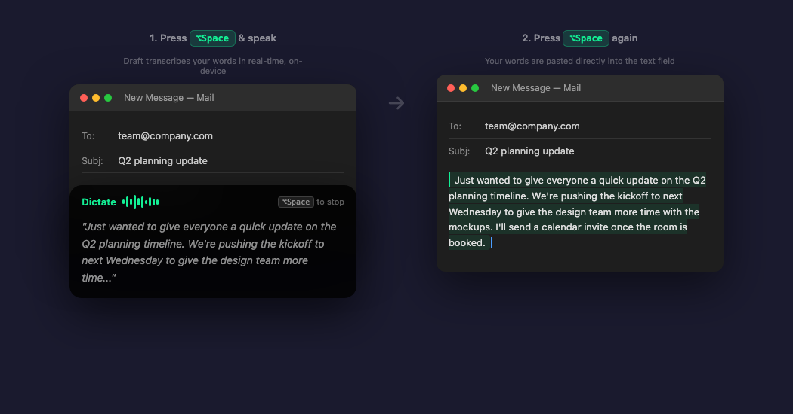
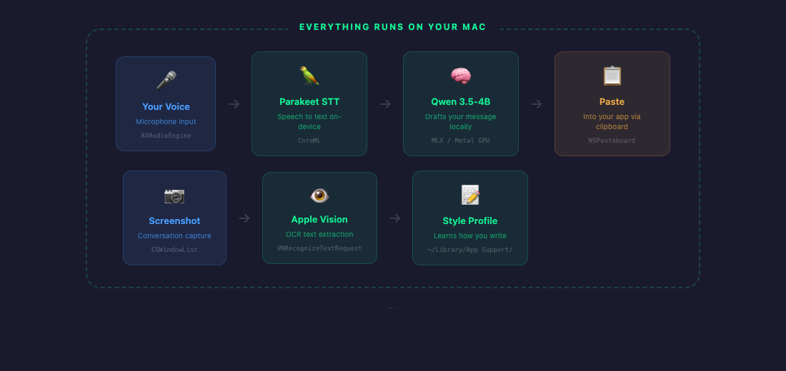

# Transcripted

Transcripted is a local Mac app for dictation and meeting capture that turns
spoken work into structured files your AI can actually use.

Use it today as a practical dictation and meeting tool. Longer term, we think
audio is the first useful layer of local AI context, because it captures real
work without asking you to maintain a second brain by hand.



## What You Get Today

- Dictate into any app and paste text back where you were already working
- Record meetings locally with mic and system audio capture
- Save human-readable Markdown and machine-readable JSON artifacts on disk
- Point Claude, Codex, or another local agent at those artifacts with a starter prompt

## Why This Exists

A lot of important context never makes it into docs or chat logs.

It shows up in:

- meetings
- dictated messages
- voice notes
- half-formed spoken thinking

Most of that context disappears as soon as the conversation ends.

Transcripted tries to preserve that high-signal spoken work locally, then turn
it into files that stay inspectable, reusable, and easy to load on demand.

## How It Works

### 1. Capture spoken work

Transcripted supports two concrete workflows today:

- dictation into any app
- local meeting recording and transcription

### 2. Process it locally

Transcripted transcribes audio on-device and keeps the resulting artifacts on
your Mac.

### 3. Save durable artifacts

Meeting recordings become:

- a Markdown transcript
- a structured JSON sidecar
- a `transcripted.json` index of saved meetings
- `AGENT.md` and `CLAUDE.md` helper docs for external agents

Dictation becomes:

- daily Markdown logs like `Dictations_2026-04-07.md`
- timestamped sections with source-app metadata and delivery status

### 4. Load the right slice later

Instead of asking an agent to read everything all the time, Transcripted gives
you durable files that can be loaded when needed:

- latest meeting
- meetings for a named speaker
- dictations from a specific day
- transcripts related to a topic or decision

## Artifacts, Not A Black Box

Transcripted is opinionated about file output because inspectable artifacts are
more useful than opaque app state.

Example meeting transcript:

```md
# Meeting with Alex

## Full Transcript

**[00:00] [Mic/You]**
Thanks for making time today.

**[00:04] [System/Alex]**
Happy to help. Let's get started.
```

Example meeting sidecar:

```json
{
  "version": "1.0",
  "recording": {
    "duration_seconds": 750,
    "engines": {
      "stt": "parakeet-tdt-v3",
      "diarization": "pyannote-offline"
    }
  },
  "speakers": [
    { "id": "mic_0", "name": "You" },
    { "id": "system_0", "name": "Alex" }
  ],
  "utterances": [
    { "start": 0.0, "end": 4.0, "speaker_id": "mic_0", "text": "Thanks for making time today." }
  ]
}
```

Example dictation artifact:

```md
---
title: "Dictations for April 7, 2026"
date: 2026-04-07
capture_type: dictation_day
---

## 9:15 AM - First note from the morning

Source app: Messages
Timestamp: 2026-04-07 09:15:00

first note from the morning
```

## Why Audio First

We do not think the answer is "capture everything."

We think the better path is:

- start with a signal people already produce during real work
- structure it into useful artifacts automatically
- let agents load more context only when they need it

Audio is a good first wedge because it is:

- high signal
- already part of meetings and messaging
- less invasive than full screen capture
- easier to structure than a full visual memory system

That does not make Transcripted an "ambient context layer" yet. It means audio
is the first practical layer of one.

## Local By Default

Transcripted keeps its core workflows on-device:

- dictation capture and saved dictation logs stay on your Mac
- meeting capture, transcription, and saved transcripts stay on your Mac
- agent-facing artifacts are plain local files you can inspect directly

Fresh installs use:

- `~/Library/Application Support/Transcripted/dictations/`
- `~/Library/Application Support/Transcripted/meetings/`

If a legacy `Draft` Application Support folder already exists, current builds
continue using that location for compatibility while the rename settles.

Operational caveats:

- first launch may download local models from HuggingFace if they are not cached
- beta builds can optionally contact the update/log proxy for update checks and diagnostics



## What Exists Today

Today, Transcripted is already useful as:

- a local dictation tool
- a local meeting recorder and transcription tool
- a file-based handoff point for external agents

The current product is not a full passive memory system. Capture is still
explicitly user-invoked. The value is that what you capture becomes durable,
structured, and reusable instead of disappearing.

## Where This Goes Next

The broader direction is to improve the audio context layer before expanding
scope.

That likely means:

- better summarization and extraction from saved artifacts
- more selective retrieval for agents
- stronger cross-meeting speaker and topic navigation
- light non-audio context later, where it clearly improves usefulness

The goal is not to make context gathering feel like a job. The goal is to make
useful context accumulate quietly, then make the right slice easy to load.

## Build

```bash
bash build-deps.sh
bash build.sh
```

## Tests

```bash
bash run-tests.sh
```

If you touch meeting integration or `TranscriptedCore`, also run:

```bash
bash run-integration-smoke.sh
```

## Transition Notes

The old standalone Transcripted app is preserved on:

- branch: `legacy/transcripted-standalone`
- tag: `pre-draft-takeover-2026-04-06`

This repo currently uses the manual migration path:

- existing standalone Transcripted installs do not auto-upgrade into this app
- fresh installs use Transcripted-named Application Support paths
- existing Draft-named Application Support folders are still reused for compatibility

## Contributing And Security

- See [CONTRIBUTING.md](CONTRIBUTING.md) for development setup and architecture notes
- See [SECURITY.md](SECURITY.md) for privacy architecture and vulnerability reporting
