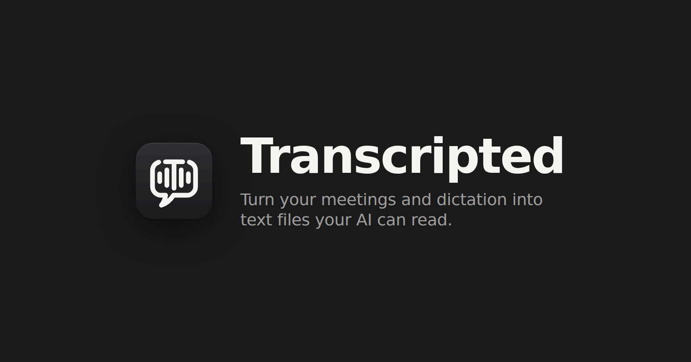
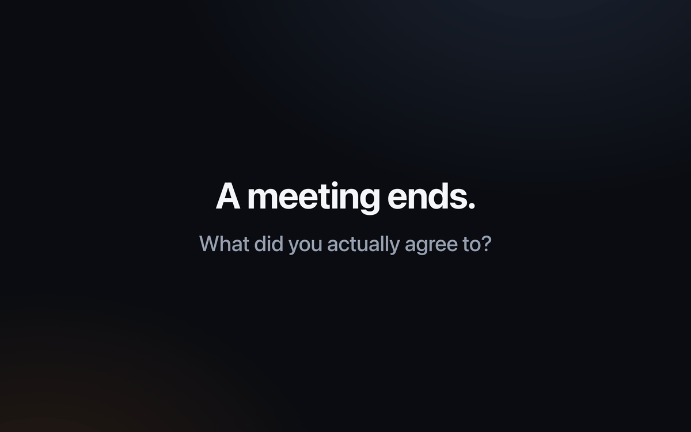
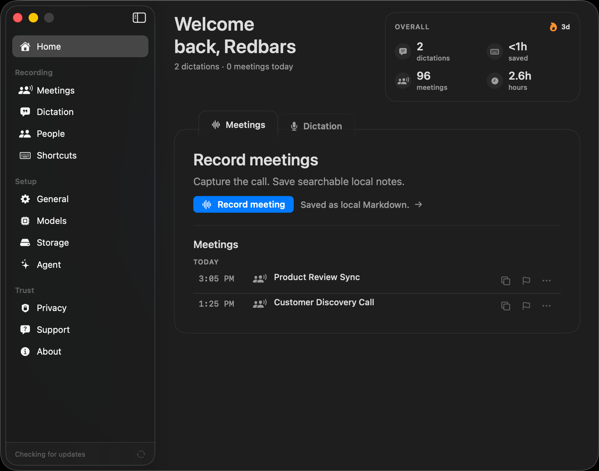
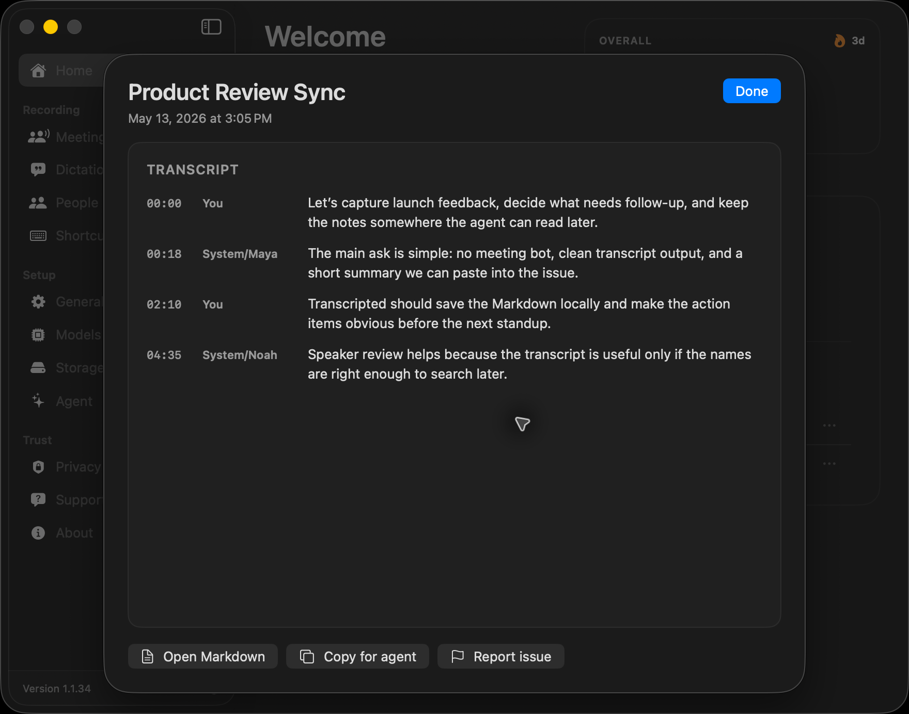
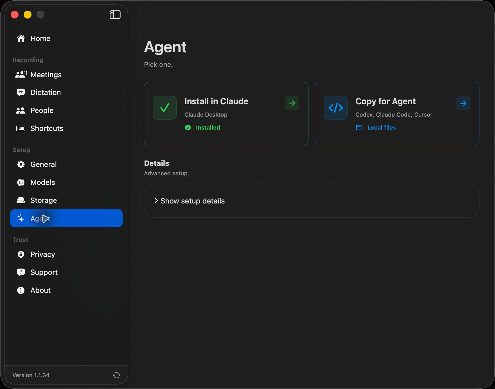
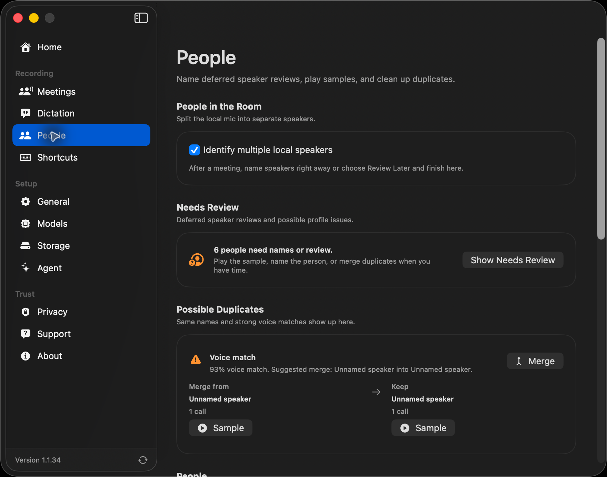
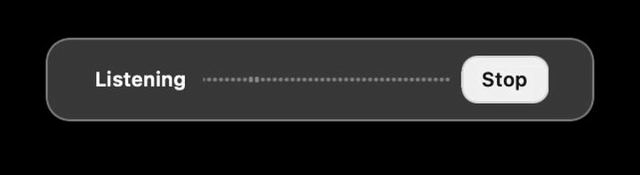

# Transcripted

[](https://github.com/r3dbars/transcripted/releases/latest)
[](https://github.com/r3dbars/transcripted/releases)
[](#install)
[](LICENSE)
[](#privacy)

**Never lose what was said.**

Transcripted records your meetings and voice notes on your Mac and saves them
as plain text files — so you, and Claude or any AI you use, can search every
conversation you've ever had.

Ask *"what did I promise this week?"* and actually get an answer.

**Free · Open source · Nothing leaves your Mac · No bot joins your calls**

[**Download for macOS**](https://transcripted.app/download/) ·
[Try the demo in your browser](https://transcripted.app/#demo) ·
[transcripted.app](https://transcripted.app)



## The problem

The most important things you say all day never make it into writing.

- A meeting ends, and the decisions evaporate by dinner.
- A good idea dies in a voice memo you'll never open again.
- You ask your AI about yesterday's call, and it has no idea what you're
  talking about.

Transcripted fixes the last one — which turns out to fix the other two.

## The moment it clicks

Every meeting and dictation becomes a plain, readable file on your Mac. Point
Claude — or Codex, Cursor, Obsidian, anything that can read a folder — at your
captures, and:

```text
You:    What did I commit to in the product review?

Claude: From Product Review Sync (May 13):
        • Decide follow-ups from the capture launch feedback
        • Keep it a clean transcript — no meeting bot
        • Post a short summary to the issue before next standup
```

Your AI stops guessing and starts quoting.

Other things people actually ask:

- What did we decide in the pricing call?
- Find every time we talked about onboarding.
- What am I repeating across conversations?

## How it works

1. **Record or speak.** Record a meeting (your mic plus the computer's audio),
   dictate with a hotkey, or drop in an audio file you already have.
2. **It becomes a file.** Transcription runs entirely on your Mac. Each capture
   is saved as readable text with timestamps and speaker names.
3. **Ask about it.** Point your AI or notes app at the folder. That's it.

## What makes it different

Most meeting tools want to trap your words in their database. Transcripted
just gives them back to you.

- **No bot joins your call.** It records on your Mac, so it works with Zoom,
  Meet, Teams, FaceTime, Slack huddles — anything you can hear — and nothing
  weird shows up in the participant list. In-person conversations work too.
- **Nothing leaves your Mac.** Audio and transcripts stay local. It works on a
  plane.
- **Files you own, not a database you rent.** Plain Markdown in normal
  folders. Search it, sync it, back it up, delete it — no export button
  required.
- **Free.** Open source, MIT licensed, no account, no subscription.

## See it

<table>
  <tr>
    <td width="50%">
      
      <p align="center"><b>One window.</b> Record a meeting or start dictating in one click.</p>
    </td>
    <td width="50%">
      
      <p align="center"><b>Every meeting becomes a transcript</b> with timestamps and speaker names — and a file you can open.</p>
    </td>
  </tr>
  <tr>
    <td width="50%">
      
      <p align="center"><b>Connect Claude in one click</b> — or just point any tool at the folder.</p>
    </td>
    <td width="50%">
      
      <p align="center"><b>Name a speaker once.</b> Voice matching suggests them next time.</p>
    </td>
  </tr>
</table>

### Dictation that lands where you type



Hit your hotkey, talk, done. The text pastes back into whatever app you were
in — your editor, an email, a Slack reply, Claude's chat box. A custom
dictionary keeps names and jargon spelled right, and Auto-Enter can send the
message for you in apps you choose.

## What's in the files

Plain Markdown. Open it yourself, search it, sync it, or hand it to an agent.

A meeting:

```md
# Product Review

Recorded Apr 10 at 3:01 PM  -  32:14  -  4,230 words

## Transcript

**00:00** [Sarah]
Keep annual pricing manual for now.

**00:04** [Michael]
Onboarding friction is still the blocker.
```

A day of dictations:

```md
# Dictations for April 10, 2026

## 9:15 AM

Need to test the onboarding changes before touching pricing.
```

Everything lives in normal folders:

```text
~/Library/Application Support/Transcripted/captures/meetings/
~/Library/Application Support/Transcripted/captures/dictations/
```

You can move the capture library anywhere you like in Settings — a synced
folder, your Obsidian vault, wherever.

## Connect your AI

Two ways, from zero-setup to one click:

- **Point it at the folder.** Claude Code, Codex, Cursor, Obsidian, and most
  tools can already read local files. Done.
- **Install the deeper Claude connection.** Open Settings → Agent → *Install in
  Claude*. That gives Claude Desktop proper tools — search your meetings, get
  recaps, look up who said what — instead of raw file reads. It's read-only:
  your agent can quote your notes, never change or delete them.

Details and other agents: [docs/agent-connect.md](docs/agent-connect.md).

## Install

**Requirements: an Apple Silicon Mac on macOS 26 or later.** The speech models
run on Apple's machine-learning stack, which is what keeps transcription fast,
private, and on-device.

Download the latest `.dmg` — signed, notarized, with automatic updates:

[**transcripted.app/download**](https://transcripted.app/download/)

Or with Homebrew:

```bash
brew tap r3dbars/transcripted https://github.com/r3dbars/transcripted
brew install --cask transcripted
```

To update later: `brew upgrade --cask transcripted` (the app also updates
itself via Sparkle).

## FAQ

**Does it work with Zoom / Google Meet / Teams?**
Yes — all of them, plus FaceTime, Slack huddles, webinars, a phone on speaker,
or a conversation in the room. If your Mac can hear it, Transcripted can
transcribe it. No calendar hookup, no bot invite.

**Is anything uploaded?**
Transcription is 100% local — audio and transcripts never leave your Mac. The
app can send anonymous crash reports and usage pings (never audio, transcripts,
titles, names, or file paths), and both have off switches in Privacy settings.

**What does it cost?**
Nothing. It's MIT-licensed open source. No account, no trial, no "pro" tier.

**How accurate is it?**
Good enough to search and quote. Parakeet (the default model) is fast and
strong, Whisper is available as an advanced option, and a custom dictionary
keeps names, acronyms, and project jargon spelled right. Speaker review cleans
up who-said-what after shared-mic meetings.

**Where do my files live?**
In plain folders under `~/Library/Application Support/Transcripted/captures/`
by default — or any folder you choose in Settings. They're yours; deleting the
app never takes your notes with it.

**Can my AI mess with my notes?**
No. The agent connection is read-only. Agents can search and quote your
captures, never edit or delete them.

## Privacy

Transcripted is local-first, and specific about it:

- Audio stays on your Mac.
- Transcripts stay on your Mac.
- It records from your Mac and never joins meetings as a bot.
- You choose which folders your agents can read; the agent tools are
  read-only.
- Anonymous crash reporting and analytics carry no transcript content, no
  audio, no names, no file paths — and you can turn both off in Settings →
  Privacy.

Full storage map: [docs/storage-paths.md](docs/storage-paths.md).

## For contributors

Transcripted is a native Swift app. To build it:

```bash
bash build-deps.sh
bash build.sh --no-open
```

And to test:

```bash
bash run-tests.sh                # curated fast tests
bash run-integration-smoke.sh    # if you touch meeting capture or TranscriptedCore
swift test                       # if you touch Package.swift or the core package seam
```

Start here:

- [AGENT_START.md](AGENT_START.md) — safe-start path (humans and coding agents)
- [CONTRIBUTING.md](CONTRIBUTING.md)
- [docs/repo-layout.md](docs/repo-layout.md)
- [SECURITY.md](SECURITY.md)

Coding agents can run `scripts/dev/agent-preflight.sh` to get a suggested
verification map for their branch.

If Transcripted is useful to you, a star helps other people find it.

## License

Transcripted's own source code is MIT licensed — see [LICENSE](LICENSE).

The shipped app bundles third-party components under their own licenses,
including eSpeak NG (GPL-3.0-or-later), Sparkle, Sentry, FluidAudio, MLX,
swift-transformers, and WhisperKit. Full license texts, versions, and source
links are in [THIRD_PARTY_LICENSES.md](THIRD_PARTY_LICENSES.md), which also
ships inside the app bundle.
