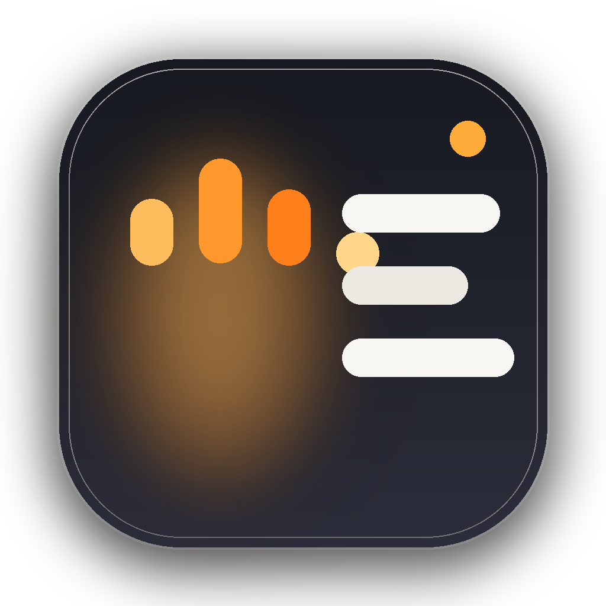

<h1 align="center">
  <a href="https://transcripted.app"></a> Transcripted
</h1>

<p align="center">
  <a href="https://github.com/r3dbars/transcripted/releases/latest"></a>
  <a href="https://github.com/r3dbars/transcripted/releases"></a>
  <a href="LICENSE"></a>
  <a href="#privacy"></a>
  
</p>

<p align="center">
  <strong>Never lose what was said.</strong><br/>
  Transcripted records your meetings and voice notes on your Mac and saves them as plain text — so you, and any AI you use, can search every conversation you've ever had.
</p>

<h3 align="center"><a href="https://transcripted.app/download/"><ins>Download for macOS</ins></a> · <a href="https://transcripted.app/#demo"><ins>Try the demo</ins></a></h3>

<p align="center">
  
</p>

<p align="center"><sub><strong>Free · Open source · Nothing leaves your Mac · No bot joins your calls</strong></sub></p>

---

## The moment it clicks

The most important things you say all day never make it into writing. A meeting
ends and the decisions evaporate by dinner. A good idea dies in a voice memo you
never open again. You ask your AI about yesterday's call and it has no idea what
you're talking about.

Every meeting and dictation becomes a plain, readable file on your Mac. Point
Claude — or Codex, Cursor, Obsidian, anything that can read a folder — at your
captures, and your AI stops guessing and starts quoting:

```text
You:    What did I commit to in the product review?

Claude: From Product Review Sync (May 13):
        • Decide follow-ups from the capture launch feedback
        • Keep it a clean transcript — no meeting bot
        • Post a short summary to the issue before next standup
```

Other things people actually ask: *What did we decide in the pricing call?* ·
*Find every time we talked about onboarding.* · *What am I repeating across
conversations?*

---

## Features

<table>
<tr>
<td width="50%" valign="middle">

### Record any meeting

Your mic plus the computer's audio, captured on your Mac. Works with Zoom, Meet,
Teams, FaceTime, Slack huddles — anything you can hear, plus the conversation in
the room. No bot joins the call, nothing weird in the participant list.

[Docs →](docs/repo-layout.md)

</td>
<td width="50%">
  
</td>
</tr>

<tr>
<td width="50%" valign="middle">

### Dictation that lands where you type

Hit your hotkey, talk, done. The text pastes back into whatever app you were in —
your editor, an email, a Slack reply, Claude's chat box. A custom dictionary
keeps names and jargon spelled right, and Auto-Enter can send the message for you.

[Docs →](docs/repo-layout.md)

</td>
<td width="50%">
  
</td>
</tr>

<tr>
<td width="50%" valign="middle">

### Connect your AI in one click

Open Settings → Agent → *Install in Claude* and your agent gets real tools —
search your meetings, get recaps, look up who said what. It's read-only: agents
can quote your notes, never change or delete them.

[Docs →](docs/agent-connect.md)

</td>
<td width="50%">
  
</td>
</tr>

<tr>
<td width="50%" valign="middle">

### Name a speaker once

After a shared-mic meeting, review who-said-what and tag each voice. Voice
matching suggests the same people next time, so your transcripts stay readable
without re-labeling every call.

[Docs →](docs/repo-layout.md)

</td>
<td width="50%">
  
</td>
</tr>
</table>

#### Also in the box

- **One window.** Record a meeting or start dictating in one click. [See it →](docs/screenshots/launch/transcripted-home.png)
- **Imported audio.** Drop in a file you already have and transcribe it locally.
- **Plain Markdown you own.** Normal folders you can search, sync, back up, or delete — no export button required.
- **Choose where it lives.** Point the capture library at a synced folder or your Obsidian vault. [Storage map →](docs/storage-paths.md)
- **Two strong models.** Parakeet by default for speed; Whisper available as an advanced option.

---

## Works with any agent

Point any tool that reads local files at your captures — or install the deeper
read-only connection for richer search and recaps.

<p>
  <a href="docs/agent-connect.md"><kbd>Claude Code</kbd></a> &nbsp;
  <a href="docs/agent-connect.md"><kbd>Claude Desktop</kbd></a> &nbsp;
  <a href="docs/agent-connect.md"><kbd>Codex</kbd></a> &nbsp;
  <a href="docs/agent-connect.md"><kbd>Cursor</kbd></a> &nbsp;
  <a href="docs/agent-connect.md"><kbd>Obsidian</kbd></a> &nbsp;
  <kbd>+ anything that can read a folder</kbd>
</p>

---

## What's in the files

Plain Markdown. Open it yourself, search it, sync it, or hand it to an agent.

A meeting:

```md
# Product Review

Recorded Apr 10 at 3:01 PM  -  32:14  -  4,230 words

## Transcript

**00:00** [Sarah]
Keep annual pricing manual for now.

**00:04** [Michael]
Onboarding friction is still the blocker.
```

A day of dictations:

```md
# Dictations for April 10, 2026

## 9:15 AM

Need to test the onboarding changes before touching pricing.
```

Everything lives in normal folders:

```text
~/Library/Application Support/Transcripted/captures/meetings/
~/Library/Application Support/Transcripted/captures/dictations/
```

You can move the capture library anywhere in Settings — a synced folder, your
Obsidian vault, wherever.

---

## Install

### Requirements — Apple Silicon Mac, macOS 26 or later

The speech models run on Apple's machine-learning stack, which is what keeps
transcription fast, private, and on-device.

### Desktop — direct download

Grab the latest `.dmg` — signed, notarized, with automatic updates:

<h3><a href="https://transcripted.app/download/"><ins>transcripted.app/download</ins></a></h3>

*Or via Homebrew:*

```bash
brew tap r3dbars/transcripted https://github.com/r3dbars/transcripted
brew install --cask transcripted
```

To update later: `brew upgrade --cask transcripted` (the app also updates itself
via Sparkle).

---

## FAQ

**Does it work with Zoom / Google Meet / Teams?**
Yes — all of them, plus FaceTime, Slack huddles, webinars, a phone on speaker, or
a conversation in the room. If your Mac can hear it, Transcripted can transcribe
it. No calendar hookup, no bot invite.

**Is anything uploaded?**
Transcription is 100% local — audio and transcripts never leave your Mac. The app
can send anonymous crash reports and usage pings (never audio, transcripts,
titles, names, or file paths), and both have off switches in Privacy settings.

**What does it cost?**
Nothing. It's MIT-licensed open source. No account, no trial, no "pro" tier.

**How accurate is it?**
Good enough to search and quote. Parakeet (the default model) is fast and strong,
Whisper is available as an advanced option, and a custom dictionary keeps names,
acronyms, and project jargon spelled right. Speaker review cleans up
who-said-what after shared-mic meetings.

**Where do my files live?**
In plain folders under `~/Library/Application Support/Transcripted/captures/` by
default — or any folder you choose in Settings. They're yours; deleting the app
never takes your notes with it.

**Can my AI mess with my notes?**
No. The agent connection is read-only. Agents can search and quote your captures,
never edit or delete them.

---

## Privacy

Transcripted is local-first, and specific about it:

- Audio stays on your Mac.
- Transcripts stay on your Mac.
- It records from your Mac and never joins meetings as a bot.
- You choose which folders your agents can read; the agent tools are read-only.
- Anonymous crash reporting and analytics carry no transcript content, no audio,
  no names, no file paths — and you can turn both off in Settings → Privacy.

Full storage map: [docs/storage-paths.md](docs/storage-paths.md).

---

## Developing

Transcripted is a native Swift app. To build it:

```bash
bash build-deps.sh
bash build.sh --no-open
```

And to test:

```bash
bash run-tests.sh                # curated fast tests
bash run-integration-smoke.sh    # if you touch meeting capture or TranscriptedCore
swift test                       # if you touch Package.swift or the core package seam
```

Start here:

- [AGENT_START.md](AGENT_START.md) — safe-start path (humans and coding agents)
- [CONTRIBUTING.md](CONTRIBUTING.md)
- [docs/repo-layout.md](docs/repo-layout.md)
- [SECURITY.md](SECURITY.md)

Coding agents can run `scripts/dev/agent-preflight.sh` to get a suggested
verification map for their branch.

If Transcripted is useful to you, a ★ helps other people find it.

---

## License

Transcripted's own source code is MIT licensed — see [LICENSE](LICENSE).

The shipped app bundles third-party components under their own licenses,
including eSpeak NG (GPL-3.0-or-later), Sparkle, Sentry, FluidAudio, MLX,
swift-transformers, and WhisperKit. Full license texts, versions, and source
links are in [THIRD_PARTY_LICENSES.md](THIRD_PARTY_LICENSES.md), which also ships
inside the app bundle.
