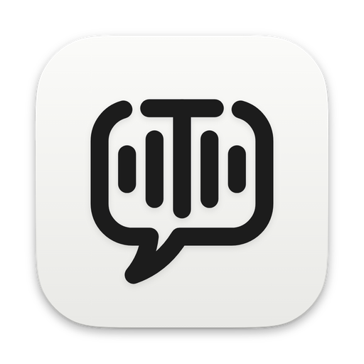
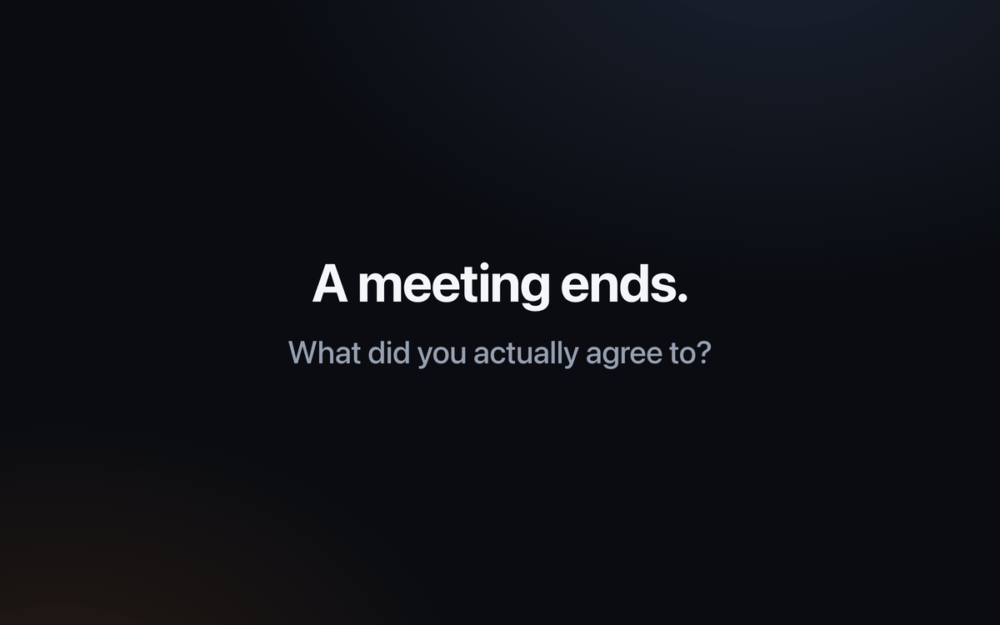

<p align="center">
  <picture>
    <source media="(prefers-color-scheme: dark)" srcset="docs/assets/app-icon-options/website/icon-dark.png">
    
  </picture>
</p>

<h1 align="center">Transcripted</h1>

<h3 align="center">Private meeting notes that never leave your Mac. No bot joins your call.</h3>

<p align="center">
  Transcripted is a free, open-source Mac app for meeting notes and dictation.
  It transcribes on your Mac and saves plain Markdown files you own.
  You can search them, or let your AI read them.
</p>

<p align="center">
  <a href="https://transcripted.app/download"><picture>
    <source media="(prefers-color-scheme: dark)" srcset="https://img.shields.io/badge/Download_for_macOS-f5f5f7?style=for-the-badge&logo=apple&logoColor=black">
    
  </picture></a>
</p>

<p align="center">
  <a href="#homebrew">Install with Homebrew</a> ·
  <a href="https://transcripted.app/#try">Interactive demo</a> ·
  <a href="https://transcripted.app">transcripted.app</a>
</p>

<p align="center">
  <a href="https://github.com/r3dbars/transcripted/releases/latest"></a>
  <a href="https://github.com/r3dbars/transcripted/releases"></a>
  <a href="#requirements"></a>
  <a href="LICENSE"></a>
</p>

<!-- Demo: an 18-second tour built from app screenshots. To replace it with a real
     screen recording, follow docs/marketing/hero-video-storyboard.md. -->
<p align="center">
  
</p>

## What it does

- **Records any meeting.** Zoom, Meet, Teams, FaceTime, or in person. It
  records your mic and your Mac's audio, so it hears both sides and nothing
  joins the call.
- **Notices when a call starts.** It offers to record. It can also remind you
  before meetings on your calendar.
- **Knows who's talking.** It splits the call by speaker. Name someone once,
  and it suggests their name the next time they talk. For in-person meetings,
  turn on **People in the room** in Settings.
- **Types what you say.** Tap a key, talk, and your words show up where you
  were typing.
- **Transcribes files.** Drop in an audio or video file you already have.
- **Helps you write, if you want.** Turn on Writing to save what you write, in
  every app or just the ones you pick, so your AI has it too. It can also
  suggest the next few words as you type. It's off until you turn it on.

Everything runs on your Mac. The speech models ship inside the app, so
transcription works offline.

## Your notes are plain files

Each meeting becomes a Markdown file with timestamps and speaker names. Here's
one, trimmed:

```md
---
title: "Product Review Sync"
capture_type: meeting
date: 2026-05-13
duration: "18:42"
transcription_engine: parakeet_local
sources: [mic, system_audio]
---

# Product Review Sync

Recorded May 13, 2026 at 3:05 PM  •  18 min, 42 sec  •  1864 words  •  27 turns

## Transcript

**00:00**  [Mic/You]
Let's capture launch feedback and decide what needs follow-up.

**00:18**  [System/Maya]
The main ask: no meeting bot, a clean transcript, and a summary for the issue.
```

By default, your notes are saved here:

```text
~/Library/Application Support/Transcripted/captures/
```

To keep them somewhere else, like an Obsidian vault, change **Capture library**
in Settings. Transcripted can move your files for you. The full format is in
[docs/capture-format.md](docs/capture-format.md).

## Ask your AI

Your notes are plain files, so any AI tool that reads files can use them.

```text
You:    What did I commit to in the product review?

Claude: From Product Review Sync (May 13):
        • Decide which launch feedback needs follow-up (00:00)
        • Make the action items clear before the next standup (02:10)
        Maya also asked for a summary for the issue (00:18).
```

For one-click setup, open Transcripted, go to **Agent**, and click **Connect**
next to Claude Desktop, Claude Code, Codex, or Cursor. For anything else, copy
the ready-made prompt from the **Something else** row. It tells your AI where
your notes are.

**Connect** adds Transcripted's MCP server to that app. MCP is an open standard
that lets AI apps use outside tools. Transcripted's tools can search and read
your notes, but they can't change or delete anything. Setup details are in
[docs/agent-connect.md](docs/agent-connect.md).

## Requirements

- A Mac with Apple silicon (M1 or later)
- macOS 26 Tahoe or later
- About 700 MB download, speech models included
- No account

Autocomplete is optional. Turning it on downloads a 3.4 GB
model. If your Mac has 16 GB of memory or more, you can pick a larger 5.6 GB
model instead.

## Install

1. [Download Transcripted](https://transcripted.app/download). It's signed,
   notarized by Apple, and updates itself.
2. Open the download and drag Transcripted into Applications.
3. Open it and allow the microphone. For meetings, also allow **System Audio
   Recording** so it can hear the other side of the call. Allow
   **Accessibility** so the keyboard shortcuts work and dictation can paste
   into other apps. **Calendar** is optional, for meeting reminders.
4. Click the menu bar icon and choose **Record**, or tap **Right Option** to
   dictate.

### Homebrew

```bash
brew tap r3dbars/transcripted https://github.com/r3dbars/transcripted
brew install --cask transcripted
```

Then do steps 3 and 4 above.

## Privacy

- Your audio, transcripts, and voice profiles never leave your Mac.
- The app keeps meeting audio so you can replay any line. You can have it
  deleted after 7 or 30 days. Transcripts stay.
- The app sends anonymous crash reports (Sentry) and usage stats (PostHog).
  Both are on by default, and you can turn them off in **Settings → Privacy**.
  They never include audio, transcripts, meeting titles, speaker names, or file
  paths. The
  [privacy contract](docs/privacy-first-observability.md#privacy-contract) has
  the full list.
- Writing never sends your text. It sends only counts, like how many
  suggestions you took, and which Writing options you chose. The same usage
  stats switch turns those off.
- Autocomplete uses the macOS Screen Recording permission to read the text on
  your screen, mostly the window you're typing in. That text stays in memory
  on your Mac and is never saved.
- If you connect a cloud AI like Claude, the notes it reads go to that AI's
  servers. Transcripted itself never uploads them.

Where everything is stored: [docs/storage-paths.md](docs/storage-paths.md).

## FAQ

**How is it different from Otter, Fireflies, or Granola?**
Otter and Fireflies are built around a bot that joins your calls, and they keep
your meetings in their cloud. Granola skips the bot, but your meetings still go
to the cloud. Transcripted does it all on your Mac, and it's free and open
source. More comparisons, including local apps like MacWhisper and Meetily:
[transcripted.app/compare](https://transcripted.app/compare).

**Does it write summaries?**
It saves the full transcript, not an AI summary. For a summary, decisions, or
action items, ask your AI. It answers from your notes.

**Does it work offline?**
Yes. Recording, transcription, and speaker labels need no internet. The app
only goes online to check for updates, download optional models, and send the
crash reports and usage stats above.

**What languages does it understand?**
The default model, Parakeet V3, covers 25 European languages, English
included. For others, pick a Whisper model in **Settings → Transcription**. It
downloads once, then runs on your Mac too.

**How accurate is it?**
Good for notes and search, but not perfect. Names and jargon are the usual
misses. If it keeps mishearing a word, add a fix under **Settings →
Transcription → Corrections** (for example, "okay ours" to "OKRs").

**Do people know I'm recording?**
Only if you tell them. There's no bot, so the app doesn't notify anyone. Tell
people before you record. In many places, the law requires their consent.

**What does it cost?**
Nothing. No account, no subscription.

**Is there a command-line tool?**
Yes, it ships inside the app. See the [CLI instructions](Tools/TranscriptedCLI/README.md).

## Uninstall

1. Quit Transcripted from the menu bar.
2. If you set up Writing, go to **System Settings → Keyboard → Input
   Sources** and remove Transcripted.
3. Drag Transcripted out of Applications, or run
   `brew uninstall --cask transcripted`.
4. Delete the Transcripted Keyboard, if it's there:
   `~/Library/Input Methods/Transcripted Keyboard.app`

Your meetings, dictations, and writing stay where they are. To also delete the
Autocomplete model and Writing's data, remove these folders:

```text
~/Library/Application Support/Transcripted/models/writing/
~/Library/Application Support/Transcripted/writing/
```

To remove everything, including voice profiles, delete
`~/Library/Application Support/Transcripted/`. That also deletes your notes if
they're still in the default folder.

## Build and contribute

It's a native Swift app. You need an Apple silicon Mac on macOS 26 or later
with Xcode 26 or later.

```bash
bash build-deps.sh
bash build.sh --no-open
bash run-tests.sh
```

Start with [CONTRIBUTING.md](CONTRIBUTING.md). Coding agents start with
[AGENTS.md](AGENTS.md). Security reports go to [SECURITY.md](SECURITY.md).

If Transcripted is useful to you, a star helps other people find it. You can
also [sponsor the project](https://github.com/sponsors/r3dbars).

## License

MIT. See [LICENSE](LICENSE). Bundled third-party code is listed in
[THIRD_PARTY_LICENSES.md](THIRD_PARTY_LICENSES.md).
